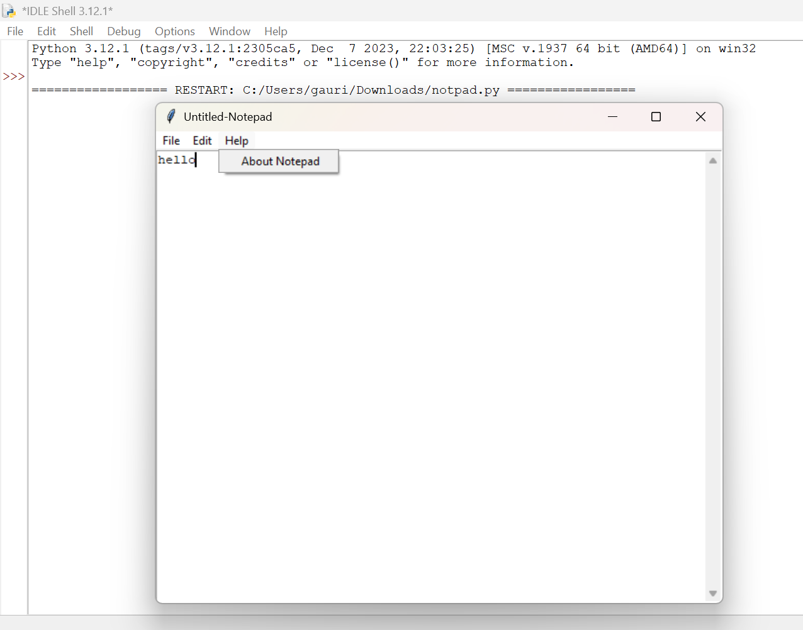

# Notepad-Code-using-python


# Simple Notepad Application 📝

This is a basic Notepad application built using Python's `tkinter` library. It provides essential text editing features like creating, opening, saving, and editing text files. The interface is designed to be simple and user-friendly.

## Features

- **Create New File**  
- **Open Existing File (.txt or any file type)**  
- **Save File / Save As**  
- **Cut, Copy, Paste**  
- **About Dialog**  
- **Scrollbar Support**

## Requirements 

- Python 3.x

`tkinter` is included with most standard Python distributions. If it's not available, you can install it via:

```bash
sudo apt-get install python3-tk    # For Debian/Ubuntu

How to Run

1. Clone this repository 📁:

git clone https://github.com/GAURIPATIL-2004/Notepad-Code-using-python.git

cd Notepad-Code-using-python


2. Run the application :

python notpad.py


File Structure 🗃️ 

notpad.py — Main application file.

Notpad.ico (optional) — Icon for the app window (place in the same directory).


Credits 🥇 

Developed by Gauri Patil


Screenshot 🖼️

